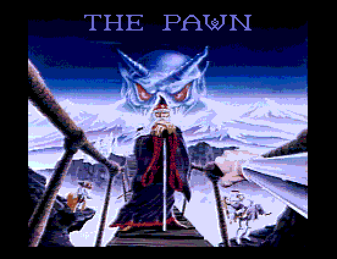
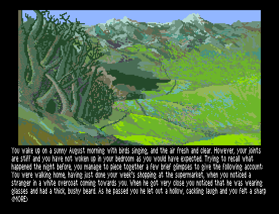
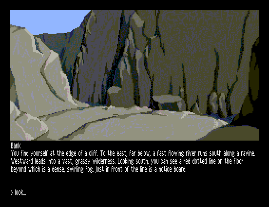
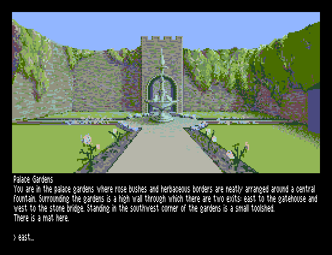
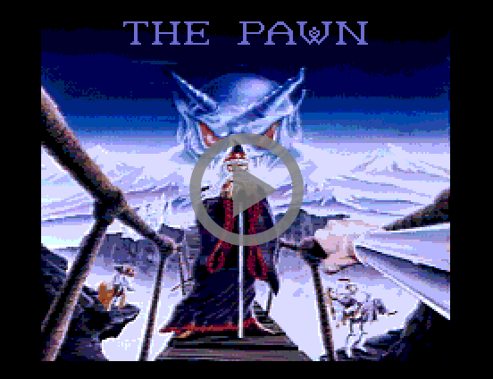

# The Pawn Demo

This is a demo of the text adventure game The Pawn for Sinclair ZX Spectrum Next.
The Pawn was first released by Magnetic Scrolls for Sinclair QL in 1985. The
Atari ST and Commodore Amiga versions released in 1986 were groundbreaking in
providing premium graphics in combination with an advanced parser. A text-only
version of the game was released for Spectrum 128 and later Spectrum +3. In this
demo, you can walk around in the world of Kerovnia and enjoy its beautiful
graphics on your Spectrum Next. If you need help finding your way in Kerovnia,
an almost accurate map can be downloaded from
[Magnetic Scrolls Memorial](http://msmemorial.if-legends.org/games.htm/pawn.php).

The purpose of the demo is to explore and demonstrate how a text adventure game
can be presented on the Spectrum Next using a combination of the layer 2 screen
for displaying colorful graphics and the Timex hi-res mode for displaying
high-resolution text with a proportional font. It also demonstrates how a text
adventure game can support a large amount of graphics and text by loading such
resources on-demand from an SD card using ESXDOS.

The purpose of the demo is *not* to provide a fully-featured playable game.
The parser is very limited, you can only walk around in the world, you cannot
interact with its in-game characters and objects. I don't intend to continue
developing the demo into a complete game since the original game is still under
copyright. Disregarding any legal issues, reimplementing the full parser and
determining all possible character/object interactions would be a huge work.
A potentially more feasible option would be to port
[Magnetic](http://msmemorial.if-legends.org/magnetic.php), Niclas Karlsson's
Magnetic Scrolls interpreter written in C, to z88dk. The Magnetic source code
would need to be restructured to support memory banking since it will not fit
in a 64 KB address space.

The demo contains all rooms with descriptions and graphics from the original
Amiga version of the game. The Amiga version of The Pawn used the same graphics
as the Atari ST version, which had 16-color images from a palette of 512 colors.
These images have been converted to Spectrum Next's layer 2 graphics mode. Some
of the images have been slightly reduced in height to fit the Spectrum Next
screen resolution.

The demo is written in C (with some parts in assembler) using
[z88dk](https://github.com/z88dk/z88dk). A big thank you to z88dk developer
Alvin for helping out with the details of customizing the I/O terminal handling
in z88dk. The graphics has been converted to Spectrum Next layer 2 format with
the [Next BMP tools](https://github.com/stefanbylund/zxnext_bmp_tools) and is
displayed in the demo using the
[zxnext_layer2](https://github.com/stefanbylund/zxnext_layer2) graphics library.
The intro music is played with the [vt_sound](https://github.com/stefanbylund/vt_sound)
C API for the Vortex Tracker II player.

The demo supports the following commands:

* north (n)
* south (s)
* west (w)
* east (e)
* northwest (nw)
* northeast (ne)
* southwest (sw)
* southeast (se)
* up (u)
* down (d)
* look (l)
* quit

## Screenshots






## Video

[](http://stefanbylund.ownit.nu/files/pawn-video.mp4 "Click to play")

## How to Run

The latest version of this program can be downloaded **[HERE](build/zxnext_pawn_demo.zip)**.
This archive contains a folder called pawndemo which contains the binaries and
the required resource files. In the descriptions below, the absolute path to the
pawndemo folder is denoted as <pawndemo>.

The demo can be run on the Spectrum Next hardware or in the CSpect 1.9 and
ZEsarUX 6.1 emulators.

### Spectrum Next

1. On your PC, unpack the downloaded ZIP file zxnext_pawn_demo.zip in the root
directory of an SD card containing the Spectrum Next firmware. The *.md and *.bat
files are not needed and can be skipped.

2. Insert the SD card in your Spectrum Next computer and start it.

3. Go to the directory pawndemo and run the program pawndemo.sna.

### CSpect Emulator

1. Install the latest version of the [CSpect](https://dailly.blogspot.se/) emulator.

2. Run the pawndemo.sna file in the CSpect emulator:

```
> CSpect.exe -w2 -zxnext -mmc=<pawndemo>/ <pawndemo>/pawndemo.sna
```

Note that the -mmc path must end with a / or \ character!

**Tip:** For convenience, you can also run the included batch file **run_cspect.bat**.
Make sure CSpect.exe is in your PATH or set the CSPECT_HOME environment variable to
the directory where it is located.

### ZEsarUX Emulator

1. Install the latest version of the [ZEsarUX](https://sourceforge.net/projects/zesarux/)
emulator.

2. Copy the contents of the pawndemo folder to
<zesarux>/extras/media/spectrum/esxdos_handler/0.8.6_TBBLUE.

3. Run the pawndemo.tap file in the ZEsarUX emulator:

```
> zesarux.exe --machine tbblue --enabletimexvideo --enable-mmc --enable-divmmc-ports --mmc-file tbblue.mmc
  --enable-esxdos-handler --esxdos-root-dir extras/media/spectrum/esxdos_handler/0.8.6_TBBLUE --quickexit
  --tape <pawndemo>/pawndemo.tap
```

**Note:** The demo does not work properly in the ZEsarUX emulator since the Timex
hi-res graphics mode cannot be combined with the layer 2 screen in ZEsarUX 6.1.
Initially, only the text will be displayed in the demo. To see the images, press
F5 in ZEsarUX and select "Settings -> Display -> Timex Real 512x192 -> No".
However, the text will now be downscaled to a 256 * 192 resolution and is thus
difficult to read.

**Tip:** For convenience, you can also run the included batch file
**run_zesarux.bat**. Make sure zesarux.exe is in your PATH or set the
ZESARUX_HOME environment variable to the directory where it is located.
You still need to manually copy the contents of the pawndemo folder to
<zesarux>/extras/media/spectrum/esxdos_handler/0.8.6_TBBLUE before running
the batch file.

## License

This software is licensed under the terms of the MIT license.

Text and graphics are copyright (C) 1985-1987 by Magnetic Scrolls Ltd.

The FZX proportional font driver is copyright (C) 2013 by Andrew Owen and Einar
Saukas.

Music track "heroquesters" is copyright (C) 2004 by Nik-O (Oleg Nikitin).

The Vortex Tracker II player in the file PT3PROM.asm is copyright (C) 2004-2007
by Sergey Bulba (http://bulba.untergrund.net/).
